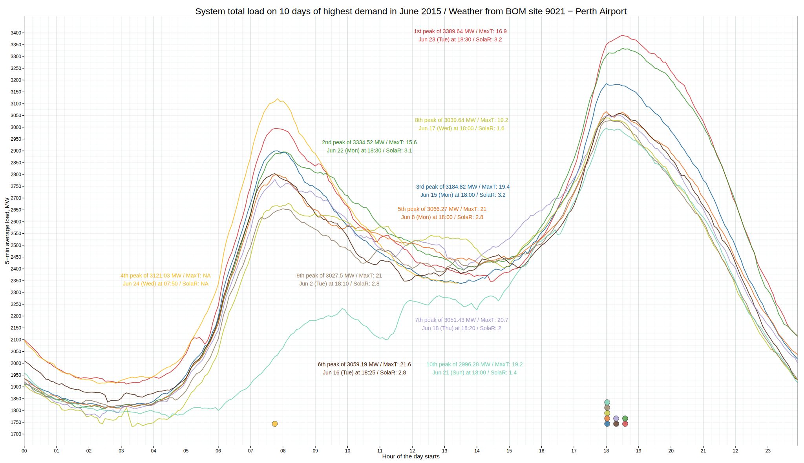

```{r setup, include=FALSE, cache=TRUE}
#http://slidify.org/start.html
#http://stackoverflow.com/questions/30155770/slidify-fails-to-build-example-markdown
#http://stackoverflow.com/questions/8009825/cannot-view-gvismotionchart-from-printed-html-file
#devtools::install_version("stringr", version="0.6.2")
#install_version("stringr", version="0.6.2")
require(knitr)
opts_chunk$set(results = "asis",comment = NA, tidy = F)
require(slidify)
require(slidifyLibraries)
require(rCharts)
require(data.table)
require(googleVis)
require(dygraphs)
require(htmlwidgets)
require(threejs)
require(leaflet)
require(rgdal)
#require(reshape2)
load("BOMDAILYTEMP.RData")
load("M.RData")
```

```{r setOptions, echo=FALSE}
options(gvis.plot.tag="chart")
```

# Agenda 

* <h2>Intro</h2>

* <h2>Package htmlwidgets</h2>

* <h2>Package rCharts</h2>

* <h2>Package googleVis</h2>

* <h2>Package plotly</h2>

* <h2>Coda</h2>

---
### **R**

<div class="alert alert-info">
<h3>R is a programming language and software environment for statistical computing and graphics. R and its libraries implement a variety of statistical and graphical techniques. Dynamic and interactive graphics are available through R packages. </h3> 
</div>

### **Data Visualisation**

<div class="alert alert-info">
<h3>Data visualization is the presentation of data in a pictorial or graphical format to understand information more easily and quickly.</h3> 
</div>

### **Interactive**

<div class="alert alert-info">
<h3>Interactive charts. What does that mean?</h3> 
</div>


---
## INTERACTIVE: <a href="#" rel="tooltip" data-original-title="Hi, I'm a Tooltip. I live in the title.">tooltipable</a>, clickable, transformable

```{r,echo=FALSE}
haireye = as.data.frame(HairEyeColor)
n1=nPlot(Freq ~ Hair, group = 'Eye', type = 'multiBarChart', data = subset(haireye, Sex == 'Male'))
#n1$show('inline', include_assets = TRUE, cdn = TRUE)
n1
```

---
## INTERACTIVE: pan-zoomable aka zoom-panable

```{r,echo=FALSE,cache=FALSE}

# ok_periods <- list(
#   list(from = "1920-1-1", to = "1930-1-1"),
#   list(from = "1940-1-1", to = "1950-1-1"),
#   list(from = "1960-1-1", to = "1970-1-1")
# )
# 
# add_shades <- function(x, periods, ...) {
#   for( period in periods ) {
#     x <- dyShading(x, from = period$from , to = period$to, ... )
#   }
#   x
# }
# 
# d2<-dygraph(nhtemp, main = "New Haven Temperatures", ylab = "Temp (F)") %>% 
# dyRangeSelector(dateWindow = c("1920-01-01", "1960-01-01")) %>%
#   add_shades(ok_periods, color = "#FFFFCC" )  %>%
#   dySeries("V1", label = "Temperature (F)") %>%
#   dyLegend(show = "always", hideOnMouseOut = FALSE)
#     
# saveWidget(d2, 'd2.html')
cat('<iframe src="d2.html"> </iframe>')

```

---
## INTERACTIVE: info-legends and series highlighting

```{r,echo=FALSE,cache=FALSE}
# lungDeaths <- cbind(ldeaths,mdeaths,fdeaths)
# d3<-dygraph(lungDeaths, main = "Deaths from Lung Disease (UK)") %>%
#   dyHighlight(highlightSeriesOpts = list(strokeWidth = 3)) %>%
#   dyLegend(width = 400) 
#  
# saveWidget(d3, 'd3.html')
cat('<iframe src="d3.html"> </iframe>')

```

--- #MR
## JavaScript libraries make it possible   
<script>
$('#MR').on('slideenter', function(){
  $(this).find('article')
    .append('<iframe src="http://bl.ocks.org/mbostock/raw/3231298/"></iframe>')
    
});
$('#MR').on('slideleave', function(){
  $(this).find('iframe').remove();
});
</script>


--- #D3 
## D3.js - Data-Driven Documents 
<script>
$('#D3').on('slideenter', function(){
  $(this).find('article')
    .append('<iframe src="http://bl.ocks.org/mbostock/raw/1256572/"></iframe>')
    
});
$('#D3').on('slideleave', function(){
  $(this).find('iframe').remove();
});
</script>


---
## Some of the key technologies

<div class="alert alert-danger alert-dismissible">
<button type="button" class="close" data-dismiss="alert" aria-label="Close"><span aria-hidden="true">&times;</span></button>
<h3>0. Standalone R wrappers for JS libraries</h3></div>

<div class="alert alert-success">
<h3>1. htmlwidgets framework to bridge R and JS </h3></div>

<div class="alert alert-info">
<h3>2. rCharts makes use of many JS libraries</h3></div>

<div class="alert alert-warning">
<h3>3. Google Chart API</h3></div>

<div class="alert alert-danger">
<h3>4. Plotly API </h3></div>


---
## <div class="alert alert-success">Technology 1: Htmlwidgets </div>

**htmlwidgets** is one of the latest interactive data visualisation 
technologies, developed specifically for R users and developers. It 
aims to make it easy to:

- produce a D3 graphic or Leaflet map with a few lines of R code

- use JS visualization libraries at the R console, just like plots

- embed widgets in R Markdown docs and Shiny web apps

- develop new widgets using a framework that bridges R and JS

There are already several R packages based on the htmlwidgets framework.


--- &twocol w1:40% w2:60%
## R packages based on htmlwidgets 

*** =left

> - **dygraphs** for time series plots
> - **leaflet** for geo-spatial mapping
> - **MetricsGraphics** - D3 scatterplots, line charts, and histograms
> - **networkD3** - D3 network graphs 
> - **d3heatmap** - interactive heatmaps with D3
> - **DT** - HTML tables with filtering, pagination, sorting
> - **threejs** - 3D scatterplot and 3D globe
> - **DiagrammeR** - diagrams & flowcharts using Graphviz & Mermaid
> - **sparkline** - small inline charts

More examples: http://www.htmlwidgets.org/

*** =right

```{r, echo=FALSE, cache=FALSE}
# d4<-dygraph(ldeaths,"Deaths from Lung Disease (UK)") %>%
#   dySeries("V1", label = "Deaths")%>%
#   dyLegend(show = "onmouseover")
# 
# saveWidget(d4, 'd4.html')
cat('<iframe src="d4.html"> </iframe>')
```

---
## A dygraph tool in action

```{r,echo=FALSE,cache=FALSE}
# fcast1 <- predict(HoltWinters(ldeaths), n.ahead = 36)
# fcast2 <- predict(HoltWinters(ldeaths,alpha=0.1), n.ahead = 36)
# fcast3 <- predict(HoltWinters(ldeaths,alpha=0.9), n.ahead = 36)
# fcast4 <- predict(HoltWinters(ldeaths,alpha=0.1,beta=0.1), n.ahead = 36)
# fcast5 <- predict(HoltWinters(ldeaths,gamma=FALSE), n.ahead = 36)
# fcast6 <- forecast::forecast(forecast::auto.arima(ldeaths), h = 36)$mean
# 
# ts <- cbind(ldeaths, fcast1,fcast2,fcast3,fcast4,fcast5,fcast6)
# 
# d1<-dygraph(ts, "Deaths from Lung Disease (UK)") %>%
#   dySeries("ldeaths", label = "Deaths")%>%
#   dyLegend(show = "onmouseover")
# 
# saveWidget(d1, 'd1.html')
cat('<iframe src="d1.html" > </iframe>')
```

---
## R code for the previous plot
```{r,eval=FALSE}
fcast1 <- predict(HoltWinters(ldeaths), n.ahead = 36)
fcast2 <- predict(HoltWinters(ldeaths,alpha=0.1), n.ahead = 36)
fcast3 <- predict(HoltWinters(ldeaths,alpha=0.9), n.ahead = 36)
fcast4 <- predict(HoltWinters(ldeaths,alpha=0.1,beta=0.1), n.ahead = 36)
fcast5 <- predict(HoltWinters(ldeaths,gamma=FALSE), n.ahead = 36)
fcast6 <- forecast::forecast(forecast::auto.arima(ldeaths), h = 36)$mean
ts <- cbind(ldeaths,fcast1,fcast2,fcast3,fcast4,fcast5,fcast6)

dygraph(ts, "Deaths from Lung Disease (UK)") %>%
  dySeries("ldeaths", label = "Deaths") %>%
  dyLegend(show = "onmouseover")
```


---
## A threejs tool in action (load vs temp vs rhum)

```{r, echo=FALSE, cache=FALSE}
# HUM<-round(M$HMAX,2);TEMP<-round(M$MAX,2);LOAD<-round(M$Load,2)
# 
# pal <- leaflet::colorQuantile("YlOrRd", NULL, n = 9)
# 
# d5<-scatterplot3js(x=HUM,y=TEMP,z=LOAD, color=pal(TEMP),
#                labels=sprintf("HUM=%.2f, TEMP=%.2f, LOAD=%.2f, DATE=%s", 
#                               HUM,TEMP,LOAD,M$Date), renderer="canvas",
#                size = LOAD/30,num.ticks = c(6, 6, 6),
#                x.ticklabs=paste(seq(min(HUM),max(HUM),length.out=6),"%"),
#                y.ticklabs=paste(seq(max(TEMP),min(TEMP),length.out=6),"C"),
#                z.ticklabs=paste(seq(min(LOAD),max(LOAD),length.out=6),"MW"),
#                signif = 6) #bg="#fffaf0"
# saveWidget(d5, 'd5.html')
cat('<iframe src="d5.html" > </iframe>')
```


---
## R code for the previous plot


```{r, eval=FALSE}
HUM<-round(M$HMAX,2);TEMP<-round(M$MAX,2);LOAD<-round(M$Load,2)

pal <- leaflet::colorQuantile("YlOrRd", NULL, n = 9)

scatterplot3js(x=HUM,y=TEMP,z=LOAD, color=pal(TEMP),
               labels=sprintf("HUM=%.2f, TEMP=%.2f, LOAD=%.2f, DATE=%s",
                              HUM,TEMP,LOAD,M$Date), renderer="canvas",
               size = LOAD/30,num.ticks = c(6, 6, 6),
               x.ticklabs=paste(seq(min(HUM),max(HUM),length.out=6),"%"),
                y.ticklabs=paste(seq(max(TEMP),min(TEMP),length.out=6),"C"),
                z.ticklabs=paste(seq(min(LOAD),max(LOAD),length.out=6),"MW"),
               signif = 6,bg="#fffaf0")
```


---
## A leaflet tool in action (numer of R users by suburb)

```{r,echo=FALSE,cache=FALSE}
# tmp <- tempdir()
# file <- "walocalitypolygon.zip"
# unzip(file, exdir = tmp)
# wa <- readOGR(dsn = tmp, layer = "WA Locality Polygon", encoding = "UTF-8")
# wa@data$num<-sample.int(100L,nrow(wa@data), TRUE)
# 
# pal <- colorQuantile("YlGn", NULL, n = 10)
# state_popup <- paste0("<strong>LOC_PID: </strong>", 
#                       wa$LOC_PID, 
#                       "<br><strong>Suburb/Locality: </strong>", 
#                       wa$WA_LOCAL_2,
#                       "<br><strong>Numer of R users :) </strong>", 
#                       wa$num)
# 
# mb_tiles <- "http://a.tiles.mapbox.com/v3/kwalkertcu.l1fc0hab/{z}/{x}/{y}.png"
# 
# mb_attribution <- 'Mapbox <a href="http://mapbox.com/about/maps" target="_blank">Terms &amp; Feedback</a>'
# 
# d6<-leaflet(data =wa) %>%
#   addTiles(urlTemplate = mb_tiles,  
#            attribution = mb_attribution) %>%
#   addPolygons(fillColor = ~pal(num), 
#               fillOpacity = 0.8, 
#               color = "#BDBDC3", 
#               weight = 1, 
#               popup = state_popup)
# 
# saveWidget(d6, 'd6.html')
cat('<iframe src="d6.html" > </iframe>')

```


---
## R code for the previous plot

```{r,eval=FALSE}
tmp <- tempdir();file <- "walocalitypolygon.zip";unzip(file, exdir = tmp)
wa <- readOGR(dsn = tmp, layer = "WA Locality Polygon", encoding = "UTF-8")
wa@data$num<-sample.int(100L,nrow(wa@data), TRUE)

pal <- colorQuantile("YlGn", NULL, n = 10)
state_popup <- paste0("<strong>LOC_PID: </strong>", wa$LOC_PID, 
        "<br><strong>Suburb/Locality: </strong>", wa$WA_LOCAL_2,
        "<br><strong>Numer of R uses :) </strong>", wa$num)

mb_tiles <- "http://a.tiles.mapbox.com/v3/kwalkertcu.l1fc0hab/{z}/{x}/{y}.png"
mb_attribution <- 'Mapbox <a href="http://mapbox.com/about/maps" 
target="_blank">Terms &amp; Feedback</a>'

leaflet(data =wa) %>% addTiles(urlTemplate = mb_tiles,  
  attribution = mb_attribution) %>% addPolygons(fillColor = ~pal(num), 
  fillOpacity = 0.8, color = "#BDBDC3", weight = 1, popup = state_popup)
```


---
## <div class="alert alert-info">Technology 2: rCharts </div> 

**rCharts** is an R package to create, customize and publish interactive 
JavaScript visualizations from R, using a familiar lattice style plotting 
interface. It aims to

- make the process of creating, customizing and sharing interactive visualizations easy
- access the power of many different JavaScript libraries, each with its own strengths
- make sensible conventions like using hPlot() function for the Highcharts library, 
mPlot() function for the Morris.js etc.
- be easily embeddable into Shiny apps, rmarkdown docs, HTML5 slides etc.


**rCharts** builds on earlier projects like  rHighcharts, rVega,  rNVD3 and 
incorporates many other names that a good web developer would  be familiar with.

--- &twocol w1:50% w2:50%
## JavaScript libraries behind R package rCharts  

*** =left

> - **jquery.dataTables.js** - Table plug-in for jQuery JavaScript library
> - **d3.js** - JavaScript library for Data-Driven Documents
> - **dimple.js** - a simple charting API for d3 data visualisations
> - **highcharts.js** - easy interactive charts for web projects
> - **leaflet.js** - for mobile-friendly interactive maps
> - **morris.js** - pretty time-series line graphs
> - **raphael.js** - simplifies work with vector graphics on the web

More details and examples: http://rcharts.io/

*** =right

> - **nv.d3.js** - re-usable charts for d3.js
> - **polychart.js** - combines data, layers, guides and interactions to create charts 
> - **rickshaw.js** - JavaScript toolkit for creating interactive real-time graphs
> - **timeline.js** - Beautifully crafted timelines that are easy and intuitive to use.
> - **uvcharts.js** - charting library based on d3.js
> - **vega.js** - interactive views using either HTML5 Canvas or SVG.
> - **xcharts.js** - xCharts is a D3-based library for building custom charts and graphs.


---
## An nvd3 tool in action 

```{r,echo=FALSE}
p2 <- nvd3Plot(Sepal.Length ~ Sepal.Width, 
    group = 'Species', data = iris, 
  type = 'scatterChart')
p2$show('inline',include_assets = TRUE)
```


---
## R code for the previous plot

```{r,eval=FALSE}
p2 <- nvd3Plot(Sepal.Length ~ Sepal.Width, group = 'Species', 
        data = iris, type = 'scatterChart')
p2$show('inline',include_assets = TRUE)
```


---
## A Highcharts tool in action

```{r,echo=FALSE}
x <- data.frame(USPersonalExpenditure)
colnames(x) <- substr(colnames(x), 2, 5)
x$industry<-rownames(x)
xx <- reshape2::melt(x,id="industry")
nPlot(value~variable, group = 'industry', data = xx, type = 'lineChart')
```

---
## R code for the previous plot

```{r,eval=FALSE}
x <- data.frame(USPersonalExpenditure)
colnames(x) <- substr(colnames(x), 2, 5)
x$industry<-rownames(x)
xx <- reshape2::melt(x,id="industry")
nPlot(value~variable, group = 'industry', data = xx, type = 'lineChart')
```

---
## <div class="alert alert-warning">Technology 3: googleVis </div> 

R package **googleVis** is the interface to **Google Charts API** for creating interactive charts based on data frames ([see examples](https://developers.google.com/chart/interactive/docs/gallery)). Google Chart tools are powerful, simple to use, and free. Note some facts:
 - data are visualised using a large number of ready-to-use chart types, from simple line charts to complex hierarchical tree maps 
 - charts are rendered using Flash/HTML5/SVG technology to provide cross-browser compatibility and cross platform portability
 - **Flash based** (Motion Charts, Annotated Time Lines, Geo Maps) and 
  **HMTL5/SVG based** (Maps, Geo Charts, Intensity Maps, Tables, Gauges, Tree Maps, Line-, Bar-, Column-, Area- and Combo Charts, Scatter-, Bubble-,      Candlestick-, Pie- and Org Charts)
 - [five vignettes](http://cran.r-project.org/web/packages/googleVis/index.html) have been written on how to use googleVis 
 - [a Slidify presentation](http://mages.github.io/Introduction_to_googleVis/) about the details and usage of googleVis is available on GitHub


---
## gvisMotionChart() in action

```{r googleVis_MotionChart}
plot(gvisMotionChart(Fruits, "Fruit", "Year", options = list(width = 600, height = 400)))
```

--- 
## gvisPieChart() in action

```{r googleVis_Pie, echo=FALSE}
Pie <- gvisPieChart(CityPopularity, options=list(gvis.editor="please edit me into a barchart",width=400, height=400))
plot(Pie)
```


--- &twocol w1:40% w2:60%
## gvisGeoChart() in action

*** =left

```{r gvisGeoChart, echo=FALSE}
df=data.frame(state=c("AU-WA","AU-VIC", 
"AU-NT", "AU-NSW", "AU-SA","AU-QLD",
"AU-TAS","NZ"), 
R_users=c(323,425,154,486,201,195,87,123))
Geo <- gvisGeoChart(df, 
locationvar="state",colorvar=c("R_users"),
options=list(region="AU",
dataMode="regions",resolution="provinces",
width=500, height=400))
plot(Geo)
```

*** =right

```{r gvisGeoChart_Code, eval=FALSE}
df=data.frame(state=c("AU-WA","AU-VIC", 
"AU-NT", "AU-NSW", "AU-SA","AU-QLD",
"AU-TAS","NZ"), 
R_users=c(323,425,154,486,201,195,87,123))
Geo <- gvisGeoChart(df, 
locationvar="state",colorvar=c("R_users"),
options=list(region="AU",
dataMode="regions",resolution="provinces",
width=500, height=400))
plot(Geo)
```

---
## <div class="alert alert-danger">Technology 4: plotly </div>

**Plotly** is an online data visualization tool, with scientific graphing libraries available for Python, R, MATLAB, Perl, Julia and other languages. 
Plotly was built using Python and the Django framework, with a front end using JavaScript and the visualization library D3.js, HTML and CSS. 
Files are hosted on Amazon S3. 

With **plottly**,
- all plots are online and editable by you and your collaborators
- you can analyse and visualize data, together 
- you can publish your ggplot2 figures to the web with one line
- your Shiny application would have plots one can zoom, pan and more

Details and examples: https://plot.ly/r/user-guide/

---
## Too many static ggplots suggest a Shiny app




---
## Adding some interactivity is another good idea

```{r,echo=FALSE}
url<-"https://plot.ly/~andrekos/30"
plotly_iframe <- paste("<center><iframe scrolling='no' seamless='seamless' style='border:none' src='", url, 
    "/800/1200' width='800' height='1200'></iframe><center>", sep = "")
```
`r I(plotly_iframe)`

---
## The end. Take-home messages

<div class="alert alert-info alert-dismissable">
<button type="button" class="close" data-dismiss="alert" aria-label="Close"><span aria-hidden="true">&times;</span></button>
<h3> htmlwidgets | rCharts | googleVis | plotly - all are good but the first seems best.</h3> 
</div>

<div class="alert alert-success alert-dismissable">
<button type="button" class="close" data-dismiss="alert" aria-label="Close"><span aria-hidden="true">&times;</span></button>
<h3>Start your own exploration for htmlwidgets and associated packages.</h3> 
</div>

<div class="alert alert-success alert-dismissable">
<button type="button" class="close" data-dismiss="alert" aria-label="Close"><span aria-hidden="true">&times;</span></button>
<h3>Try them in various environments, e.g. web apps, rmd docs, HTML5 presentations.</h3> 
</div>

<div class="alert alert-warning alert-dismissable">
<button type="button" class="close" data-dismiss="alert" aria-label="Close"><span aria-hidden="true">&times;</span></button>
<h3>Develop your own widget, either to learn by doing or start a really useful project.</h3> 
</div>

<div class="alert alert-warning alert-dismissable">
<button type="button" class="close" data-dismiss="alert" aria-label="Close"><span aria-hidden="true">&times;</span></button>
<h3>An R package for animated heatmaps for weather data with turf.js sounds cool. </h3> 
</div>


--- &radio

## What is the best theme for the 3rd WARG event?

I am sure you will be able to deductively conclude that the correct answer is ...

1. Dashboards in R with Shiny & plotly

2. Exploring Hadley's recent R packages (readr, readxl, rvest, etc)

3. Building R packages in the modern way (with RStudio and roxigen2)

4. _Twitter's AnomalyDetection vs. Hyndman's anomalous R packages_

5. S4 vs. S3, object.size(), gc() and other advanced topics

6. Maps and spatial data analysis using R

*** .hint 
Well, right now, I personally would like to learn more about 2, 4 and maybe 6, or even 1.


*** .explanation 
That's right! I love time series, especially if it's about [detecting anomalies]
(https://blog.twitter.com/2015/introducing-practical-and-robust-anomaly-detection-in-a-time-series).

